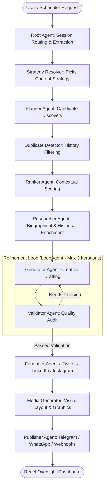

# 🏭 Liber Content Factory
### A General-Purpose Multi-Agent Content Automation Framework

**Capstone Submission — AI Agents: Intensive Vibe Coding (Google × Kaggle)**  
**Repository:** [github.com/sudh29/liber_content_factory_system](https://github.com/sudh29/liber_content_factory_system)  
**Video Walkthrough:** [youtu.be/iAzrd1AmMMg](https://youtu.be/iAzrd1AmMMg)

---

## 🌟 Overview

**Liber Content Factory** is an enterprise-grade, autonomous multi-agent content generation and publishing framework built on top of the **Google Agent Development Kit (ADK)** and **Gemini 2.5 Flash**. 

Unlike single-purpose demo scripts, Liber is designed as a **reusable platform** using the Strategy Pattern. The flagship end-to-end tenant running on this framework is the **Daily Quote Generator**: an autonomous pipeline that discovers inspirational quotes, deduplicates them against publishing history, ranks candidates by contextual relevance, conducts background research, drafts and self-validates copy through an iterative feedback loop, formats for multi-platform distribution, generates accompanying visual media, and publishes across messaging and social channels — all supervised by a human-in-the-loop React dashboard.

---

## ✨ Key Features

- **🧠 Sequential & Iterative Multi-Agent Architecture**: Powered by Google ADK primitives (`SequentialAgent`, `LoopAgent`), orchestrating 9 specialized agents in a clean, modular pipeline.
- **🔄 The Generate → Critique Refinement Loop**: Drafts are adversarially reviewed by a Validator agent against strict quality rubrics (verbatim quote accuracy, hashtag relevance, CTA clarity, anti-fluff rules) with automatic self-correction up to 3 iterations.
- **🛡️ Multi-Layer Security Guardrails**: Built-in input validation (prompt injection mitigation, length checks) and output sanitization (harmful content blocklists, formatting verification) before content is trusted.
- **📊 Human-in-the-Loop React Dashboard**: Live WebSocket/HTTP streaming of agent reasoning steps, per-platform visual cards (Twitter/X, LinkedIn, Instagram), audit logging, and one-click publishing or scheduling.
- **📡 Multi-Channel Publishing Engine**: Out-of-the-box integrations for **Telegram Bot API**, **WhatsApp** (via self-hosted WAHA HTTP bridge), and generic webhook endpoints.
- **📈 Built-in Observability & Tracing**: Instrumented with **OpenTelemetry** with pluggable exporters for Google Cloud Trace and local development console logging.
- **🧩 Pluggable Declarative Skills**: Extensible capability packages (`context-extractor`, `linkedin-hook-generator`, `qa-validator`) defined as declarative `SKILL.md` instructions.
- **🧪 Quality Flywheel & Evaluation Harness**: Integrated with `google-agents-cli` evaluation suites (`eval generate`, `eval grade`) and an extensive `pytest` testing matrix.

---

## 🏗️ System Architecture

The core orchestration follows a strict sequential flow with an embedded self-correction loop:



### The Strategy Pattern
The framework decouples pipeline orchestration from domain logic. By implementing the `ContentStrategy` interface (`DailyQuoteStrategy`, `GenericContentStrategy`), developers can reuse the exact same 9-agent workflow to drive newsletters, product announcements, technical blogs, or social media digests without touching core agent code.

---

## 🛠️ Technology Stack

| Component | Technology / Library | Description |
| :--- | :--- | :--- |
| **Agent Framework** | Google Agent Development Kit (ADK) | `SequentialAgent`, `LoopAgent`, custom `BaseAgent` runners |
| **LLM Engine** | Google Gemini 2.5 Flash | Fast, cost-effective, high-reasoning model (configurable in `.env`) |
| **Backend API** | Python 3.10+, FastAPI, `uv` | High-performance asynchronous API server and CLI runner |
| **Frontend UI** | React 18, Vite, TypeScript, Tailwind CSS | Responsive human-in-the-loop dashboard with real-time agent step animations |
| **Observability** | OpenTelemetry, Cloud Trace | Distributed tracing, prompt-response logging, and latency metrics |
| **Integrations** | Telegram Bot API, WAHA (WhatsApp), Webhooks | Direct messaging distribution channels and webhooks |
| **Testing & Eval** | `pytest`, `google-agents-cli eval` | Unit tests, guardrail policy verification, and LLM-as-judge grading datasets |

---

## 📁 Repository Structure

```text
├── agent-backend/               # Python Multi-Agent Backend & API Server
│   ├── liber_content_factory/   # Main Python package
│   │   ├── agents/              # ADK Agent definitions (Planner, Ranker, Generator, Validator, etc.)
│   │   ├── api/                 # FastAPI routes (content generation, publishing, logs, credentials)
│   │   ├── config/              # Settings & environment configuration
│   │   ├── guardrails/          # Input/Output security & prompt injection protection
│   │   ├── services/            # Fallback generators, database adapters, and external tools
│   │   └── strategies/          # Strategy implementations (DailyQuoteStrategy, etc.)
│   ├── main.py                  # CLI execution entrypoint
│   ├── server.py                # HTTP API Server entrypoint (Port 8000)
│   └── pyproject.toml           # Python dependencies & metadata
├── frontend/                    # React / Vite / TypeScript Dashboard
│   ├── src/
│   │   ├── components/          # Dashboard widgets (ContentGeneration, PublishingEngine, AuditLog)
│   │   └── services/            # API client adapters & state management
│   ├── package.json             # NPM dependencies
│   └── vite.config.ts           # Vite configuration with API proxying
├── tests/                       # Test Suites & Evaluation Datasets
│   ├── unit/                    # Pytest unit tests & ADK pipeline wiring verification
│   ├── integration/             # Security policy & guardrail testing (`test_security_policies.py`)
│   └── eval/                    # `google-agents-cli` dataset (`basic-dataset.json`)
├── .agents/skills/              # Declarative ADK Skills (`context-extractor`, `qa-validator`, etc.)
├── CAPSTONE.md                  # Detailed Capstone Project Architecture & Course Mapping
├── RUN.md                       # Complete Setup & Execution Guide
└── docker-compose.yml           # Local container orchestration (WAHA bridge, etc.)
```

---

## 🚀 Quick Start Guide

### Prerequisites
- **Python 3.10+** (using `uv` is recommended: `uv tool install google-agents-cli`)
- **Node.js 18+** and **npm**
- **Google Gemini API Key** (Get one from [Google AI Studio](https://aistudio.google.com/))

### 1. Backend Setup & Configuration
```bash
# Navigate to project root
cd liber_content_factory_system

# Create environment configuration
cp .env.example .env  # Or create .env manually and add your key:
echo "GEMINI_API_KEY=your_api_key_here" >> .env
echo "GEMINI_MODEL=gemini-2.5-flash" >> .env

# Install Python backend dependencies using uv
cd agent-backend
uv pip install -e ".[dev]"
```

### 2. Start the Backend API Server
```bash
# Run the server from the agent-backend directory
uv run server.py
# Server will start on http://127.0.0.1:8000
```

### 3. Start the Frontend Dashboard
Open a new terminal window:
```bash
cd frontend

# Install Node dependencies
npm install

# Start the Vite development server
npm run dev
# Dashboard will open on http://localhost:5173
```

---

## 💻 CLI & Interactive Testing

You can trigger the content factory pipeline directly from the command line without starting the frontend:

```bash
cd agent-backend

# Generate content via CLI
uv run python main.py generate --strategy quotes --topic "AI and creativity"

# Run interactive ADK Web Playground to chat with agents & inspect reasoning steps
uvx google-agents-cli playground

# Run standalone prompt test with verbose JSON event logging
uvx google-agents-cli run "Write a thread about autonomous AI agents" -v
```

---

## 🧪 Testing & Evaluation

### Running Unit & Security Tests
Verify pipeline orchestration, guardrails, and anti-injection security policies:
```bash
cd agent-backend
uv run pytest ../tests/ -v
```

### Running ADK Evaluation Harness
Execute multi-turn eval datasets and LLM-as-judge grading using `google-agents-cli`:
```bash
# Generate evaluation traces against the test dataset
agents-cli eval generate --dataset ../tests/eval/datasets/basic-dataset.json

# Grade evaluation results
agents-cli eval grade
```

---

## 📚 Documentation & Further Reading

- [**CAPSTONE.md**](file:///home/liber_primus/code/liber_content_factory_system/CAPSTONE.md): Comprehensive capstone project documentation, architecture design decisions, guardrail implementations, and mapping to course concepts.
- [**RUN.md**](file:///home/liber_primus/code/liber_content_factory_system/RUN.md): In-depth operational guide, environment variable reference, Docker setup, and troubleshooting tips.

---

## 📄 License & Acknowledgments
Built for the **Google × Kaggle AI Agents: Intensive Vibe Coding** Capstone Project.  
Powered by **Google Gemini** and the **Google Agent Development Kit (ADK)**.
