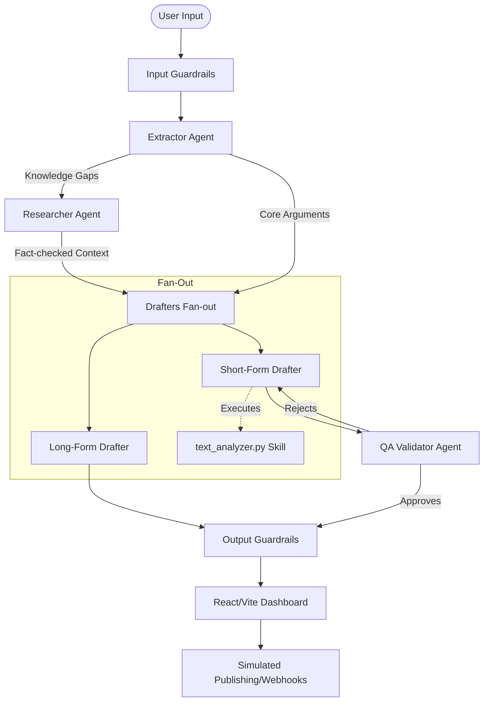

# Liber Content Factory System

The Content Factory System is an enterprise-grade multi-agent pipeline and scheduling dashboard designed to solve the problem of scaling authentic, high-quality content creation without falling victim to AI hallucination, context rot, or plagiarism.

## The Problem
Modern businesses and content creators struggle to maintain a consistent output of high-quality social media and long-form content. Relying on single, monolithic LLM prompts often leads to "context rot," hallucinated facts, and repetitive, generic writing. Furthermore, managing the generated content requires fragmented tools for editing, deduplicating, and publishing.

## The Solution
The Liber Content Factory solves this by decoupling the creative process into a **Multi-Agent System**. Instead of one massive prompt, specialized AI agents (Extractor, Researcher, Drafter, QA Validator) handle distinct phases of content generation. The pipeline enforces strict security guardrails, grounds generation in verified research, and utilizes a deterministic QA loop. The output is then managed by a custom React dashboard that handles deduplication, simulated API publishing, and scheduling.

## Architecture Overview



The system consists of two primary components:

1. **Python Multi-Agent Pipeline (`src/`)**: A backend pipeline that orchestrates multiple LLM calls.
2. **React/TypeScript Social Scheduler (`social-scheduler/`)**: A frontend dashboard for previewing, scheduling, and publishing content.

### Multi-Agent Pipeline Stages

The pipeline follows a strict Orchestrator-Worker paradigm to avoid context rot and ensure high-quality output:

1. **Extractor Agent**: Converts unstructured raw input into a structured `ExtractionSchema` containing core arguments, evidence, and knowledge gaps.
2. **Researcher Agent**: If knowledge gaps exist, this agent uses Gemini's Google Search capabilities to find facts and generates a Markdown reference document.
3. **Drafters (Fan-out)**:
   - **Long-Form Drafter**: Generates a comprehensive blog post using local context and research.
   - **Short-Form Drafter**: Generates a social media hook (e.g., for LinkedIn) utilizing the `linkedin-hook-generator` skill.
4. **QA Validator Agent**: Acts as an LLM-as-a-Judge to adversarially evaluate the drafted content against rubrics. If it fails, it provides feedback and triggers a revision loop (up to a configured maximum number of attempts).

### Security & Observability

- **Guardrails**: Built-in security policies screen inputs for prompt injections and secret leaks, and screen outputs for leaked system prompts and credentials.
- **Audit Logging**: The `PipelineObserver` records granular, timestamped JSON logs of every pipeline step, execution time, and artifact state.

## Getting Started

### Prerequisites

- Python 3.10+
- A Google Gemini API Key

### Installation

The project uses a standard `pyproject.toml`.

```bash
# Clone the repository
git clone <repository_url>
cd liber_content_factory_system

# Create a virtual environment
python -m venv .venv
source .venv/bin/activate  # On Windows: .venv\Scripts\activate

# Install dependencies (including optional dev dependencies for testing)
pip install -e ".[dev]"
```

### Configuration

Create a `.env` file in the project root:

```bash
cp .env.example .env
```

Edit the `.env` file and add your Gemini API key:

```env
GEMINI_API_KEY=your_gemini_api_key_here
```

### Usage

Run the pipeline from the command line using the installed entry point or directly via `main.py`:

```bash
# Using the installed script
content-factory --input "We need a blog post about how multi-agent systems are better than single LLMs."

# Using main.py directly
python main.py --input "Explain the benefits of the MCP protocol."

# Load input from a file
python main.py --file prompt.txt

# Enable verbose logging
python main.py --verbose --input "..."
```

## Testing

The project includes a comprehensive test suite covering the agents, orchestrator, and security policies.

```bash
# Run all tests
pytest tests/ -v
```

## Project Structure

```text
├── main.py                 # CLI entry point
├── pyproject.toml          # Project configuration and dependencies
├── src/                    # Python package source
│   ├── config.py           # Centralized configuration management
│   ├── orchestrator.py     # ContentPipeline class and lifecycle management
│   ├── hooks.py            # Audit logging and observability observer
│   ├── security_policies.py# Input/output security guardrails
│   └── agents/             # Specialized AI agents
│       ├── extractor.py    # Context extraction
│       ├── researcher.py   # Web research
│       ├── drafters.py     # Content generation
│       └── validator.py    # QA and evaluation
├── tests/                  # Pytest test suite
├── .agents/                # Agent skills definitions
│   └── skills/
├── social-scheduler/       # React frontend application
└── shared/                 # Shared frontend code (types, utils, data)
```